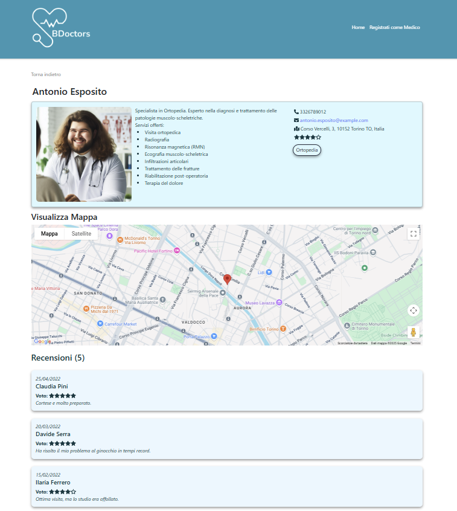

# 🩺 BDoctors – Frontend per la Ricerca e Recensione di Professionisti Medici

**BDoctors** è l'interfaccia web per un'applicazione che consente agli utenti di cercare professionisti del settore medico, visualizzarli su mappa, leggere recensioni e registrarne di nuovi nel sistema.

## 🚀 Funzionalità principali

- 🔍 Ricerca di medici per specializzazione e località
- 🗺️ Visualizzazione degli studi medici su **Google Maps**
- ✍️ Invio di **recensioni**, con validazione dei dati
- ➕ Registrazione di **nuovi medici** tramite form dedicato
- 💬 Interfaccia reattiva e user-friendly sviluppata con **React**

## 🛠️ Tecnologie utilizzate

- **Frontend:** React, JavaScript, HTML/CSS
- **Librerie principali:**
  - Google Maps API
  - React Hook Form (o simili) per la gestione dei form
  - Axios per le richieste HTTP

## 📷 Screenshot

